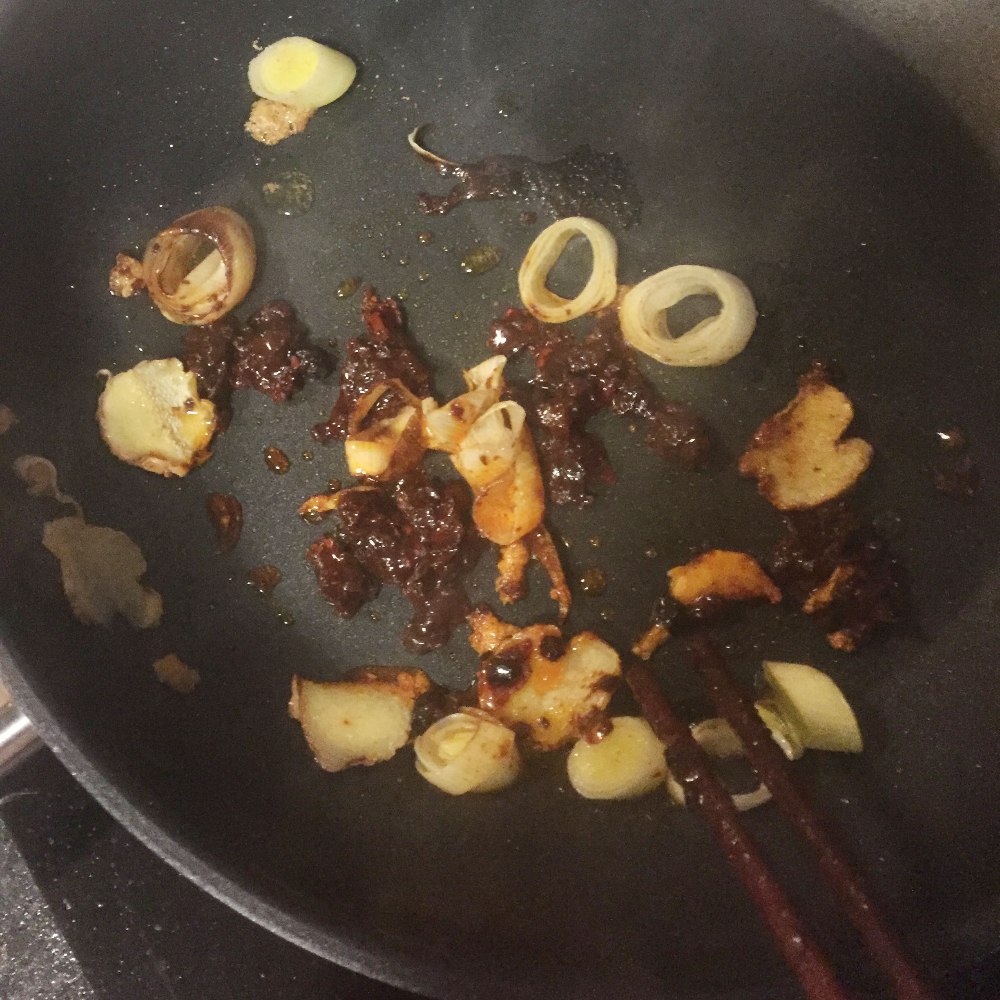

#  Stir-fried Pork with Bell Pepper Recipe by Ivan

## Ingredients
* Pork Belly
* Bell Peppers
* Sunflower Oil
* Soy Sauce 
* Leek, cut into slices
* Garlic
* Ginger, cut into slices
* Sugar
* Salt
* Pixian County Bean Sauce (IMPORTANT Chinese name:郫县豆瓣酱)
* Lao Gan Ma Chili Crisp Sauce (optional, Chinese name:老干妈辣椒酱, the logo of this is an old lady )
* Chinese Five Spice powder (optional, if you have it will taste better)

## Method
1.Cut the leek, garlic and the ginger into slices and mixed them into a small bow

2.Cut the pork into bite-sized pieces and put them into another small bow.

3.Cut the bell pepper into slices

4.Blanch the pork pieces in the boiling water and do so for 2 to 4 minutes

5.Use chopsticks or forks(if you use forks, DO NOT CUT THE PORK INTO VERY THINY PIECES) to pick each pork pieces into a clean plate

6.Heat the oil in a wok over a high heat.

7.Add the leek slices, ginger slices, garlic powder on the oil. Stir fry them for 30 seconds.

8.Add 3teaspoon Pixian County Bean Sauce, 2teaspoon Lao Gan Ma Chili Crisp Sauce (optional),1teaspoon Chinese Five Spice powder (optional). Stir fry them for 1 minute.

9.Add the bell pepper slices into the wok and then stir fry to mix them for 1 minute. Then add the pork slices into the wok.

10.Add **3teaspoon soy sauce**, 2teaspoon sugar and 0.5teaspoon salt into the wok and then stir fry them for 1 minute. 

11.Add a little water to the wok.

12.Turn off the power till the evaporation of water and pour them into the bowl.

Enjoy it.

# Appendix

Pixian County Bean Sauce

